

<link rel="stylesheet" type="text/css" href="style.css">

# Layout布局

协助进行页面级整体布

## 组件概述

**Layout：**布局容器，底层模块其下可嵌套 Header Sider Content Footer 或 Layout 本身，可以放在任何父容器中。

**Header：**顶部导航栏，自带默认样式，且始终固定

**Sider：**侧边栏，自带默认样式及基本功能，宽度可折叠扩展

**Content1：**内容展示区，自带默认样式，通常情况下只承载数据列表相关内容

**Content2：** 功能操作区，自带默认样式，通常情况下承载相关操作表单、侧导航、标题栏等内容

**Footer**：底部布局，自带默认样式，其下可嵌套任何元素，只能放在 Layout 中

## 尺寸视觉快速查阅

| 名称     | 尺寸                      | 视觉（黑） | 视觉（蓝） |
| -------- | ------------------------- | ---------- | ---------- |
| Header   | 高度 32px，  宽度：1440px | #161616    |            |
| Sider    | 宽度150px ， 拓展150px+8n | #2B2B2B    |            |
| Footer   | 高度28px                  | #161616    |            |
| Content1 | -                         | #000000    |            |
| Content2 | -                         | #2B2B2B    |            |
| Space    | 2px                       | #4C4C4F    |            |

## 典型的页面布局

> 上中下布局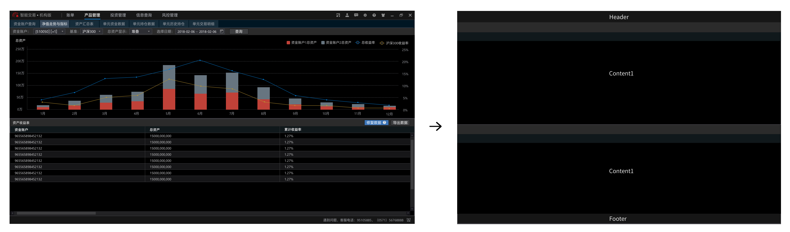

> 顶部-侧边布局-通栏
>
> 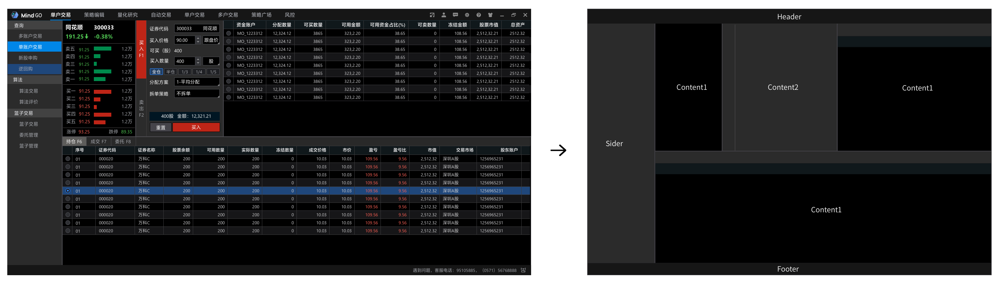

# 顶部栏Header

## LOGO

| 左边距             | 左边距 | 上下间距 |
| ------------------ | ------ | -------- |
| 高度20px 宽度 84px | 10px   | 6px      |

## 文字

| 版本 | 字号 | 默认颜色 | 悬停颜色 | 选中颜色             |
| ---- | ---- | -------- | -------- | -------------------- |
| 黑版 | 14px | #BDC0C7  | #F7FAFF  | #FFFFFF 加粗Semibold |
| 蓝版 | 14px |          |          |                      |

## ICON

 <u>[下载点击icon](终端Confluence.assets/顶部栏)</u>

| 版本 | 容器大小  | 默认颜色 | 悬停颜色 | 点击颜色 |
| ---- | --------- | -------- | -------- | -------- |
| 黑版 | 16px*16px | #8E8E8E  | #D2D2D3  | #616266  |
| 蓝版 | 16px*16px |          |          |          |

> 提供SVG格式图标，请程序调用也使用svg矢量图片，避免高清屏模糊问题

> 实例展示
>
> 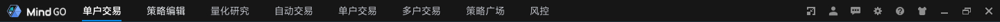

# 底部栏Footer

## 文字

| 版本 | 字号 | 默认颜色 |
| ---- | ---- | -------- |
| 黑版 | 12px | #BDC0C7  |
| 蓝版 | 12px |          |

## ICON

 <u>[下载点击icon](终端Confluence.assets/底部栏)</u>

| 版本 | 容器大小  | 默认颜色 | 悬停颜色 | 点击颜色 |
| ---- | --------- | -------- | -------- | -------- |
| 黑版 | 16px*16px | #8E8E8E  | #D2D2D3  | #616266  |
| 蓝版 | 16px*16px |          |          |          |

# 侧边栏Sider

## 菜单项

| 版本 | 尺寸                          | 上下间距 | 默认颜色 | 悬停颜色 | 选中颜色 |
| ---- | ----------------------------- | -------- | -------- | -------- | -------- |
| 黑   | 高度28px 宽度自适应菜单栏大小 | 0px      | #2B2B2B  | #20477B  | #0086E6  |
| 蓝   | 高度28px 宽度自适应菜单栏大小 |          |          |          |          |

## 文字

| 版本 | 字号 | 默认颜色 | 悬停颜色 | 选中颜色 |
| ---- | ---- | -------- | -------- | -------- |
| 黑版 | 13px | #A6A9AE  | #F7FAFF  | #FFFFFF  |
| 蓝版 | 13px |          |          |          |

## 实例

> 

# Table表格

最基础的数据列表展示，可承载文字、列表、常用于数据展示页面

## 何时使用

-   当有大量结构化的数据需要展现时；

-   当需要对数据进行排序、搜索、分页、自定义操作等复杂行为时

## 组件概述

**Header：**表头容器，用于放置表头字段文字

**Columns**：表格项容器，自带默认样式

**Columns-space：**表格项容器间隔，自带默认样式

**Line：**分割线，用于表格内数据项的分割，包括表头表项都使用同一种

## 尺寸视觉快速查阅

| 名称                 | 尺寸     | 视觉（黑） | 视觉（蓝） |
| -------------------- | -------- | ---------- | ---------- |
| Header 表头容器      | 高度24px | #11181C    |            |
| Columns 表格项容器   | 高度22px | #000000    |            |
| Columns-space 间隔   | 高度22px | #161517    |            |
| Columns-hover 悬浮   | 高度22px | #46494F    |            |
| Columns-pressed 选中 | 高度22px | #20477B    |            |
| Line 分割线          | 1px      | #3B3B3D    |            |

## 文字

| 名称               | 字号          | 视觉（黑） | 视觉（蓝） | 对齐方式 |
| ------------------ | ------------- | ---------- | ---------- | -------- |
| Title 表头字段     | 12px semibold | #FFFFFF    |            |          |
| Text-text 文字默认 | 12px          | #D2D2D3    |            |          |
| Text-edit 可编辑   | 12px          | #498FDE    |            |          |
| Text-perssed 选中  | 12px          | #FFFFFF    |            |          |
| Text-Number 金额   | 12px          | #D2D2D3    |            |          |
| Text-Date 日期     | 12px          | #D2D2D3    |            |          |
| Text-up 涨         | 12px          | #FF6155    |            |          |
| Text-down 跌       | 12px          | #50C752    |            |          |
| Text-buy 买        | 12px          | #FF6155    |            |          |
| Text-sell 卖       | 12px          | #6EAFFF    |            |          |

## 典型实例

> **简单的表格**
>
> 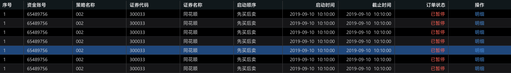

> **可选择表格**
>
> - 第一列选择框，包含单选多选
>- 默认点击 checkbox 触发选择行为，需要点击行触发可以[参考checkbox说明]()
> 
>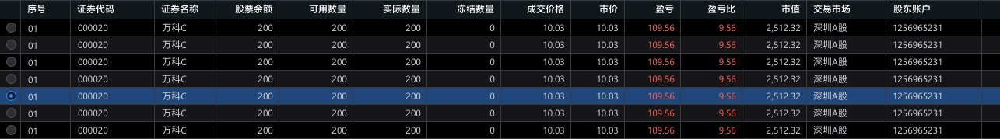

> **带排序表格**  [控件下载](终端Confluence.assets/表格)
>
> - 带有排序控件的字段即可进行排序操作，选中后当前字段背景色变为：\#293136
>
> 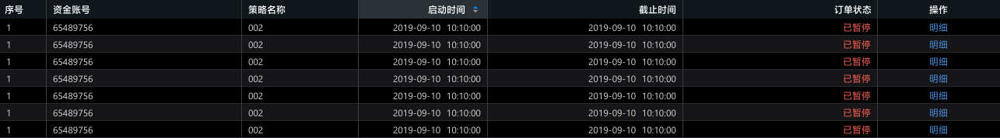

> **买卖方向提示性表格**
>
> - 为了区分买卖方向的视觉识别，故将买入与卖出行分别用红蓝进行区别，一般用于买卖操作的记录
>
> 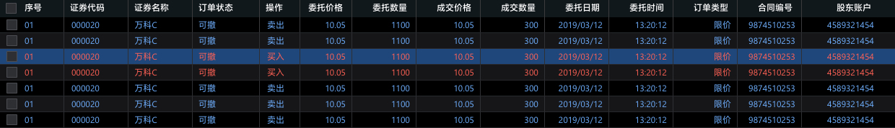

> **包含可编辑单元格的表格**
>
> - 编辑输入文本框，详细交互效果可查阅[输入框Input模块](#Input输入框)
>
> 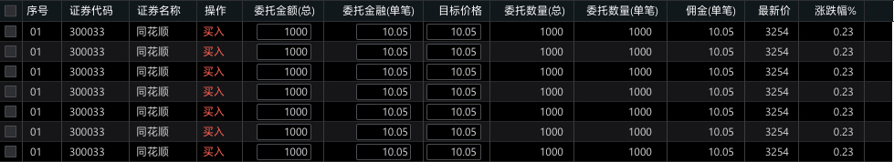

> **嵌套型子表格**
>
> - 嵌套表格表头颜色：#282829
> - 嵌套表格单元格颜色：#1C1D21
>
> 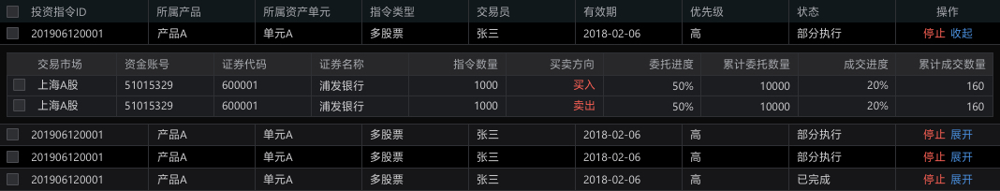

> **带浮窗筛选表格**
>
> 浮窗：尺寸110px*60px  底色#2B2B2B  描边 1px #434448
>
> check栏：尺寸24px*58px 底色#141415 
>
> 文字：14px #FFFFFF
>
> 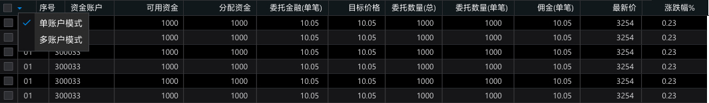

# Radio单选框

## 何时使用

-   用于在多个备选项中选中单个状态。

-   和 `Select` 的区别是，`Radio` 所有选项默认可见，方便用户在比较中选择，因此选项不宜过多

## 基本

-   尺寸：13px，包含内描边

- 文本与Radio间距：8px

  > 

## 文字

| 名称         | 字号 | 视觉（黑） | 视觉（蓝） |
| ------------ | ---- | ---------- | ---------- |
| Text-normal  | 13px | #D2D2D3    |            |
| Text-disable | 13px | #616266    |            |

## 控件下载

[点击下载](终端Confluence.assets/单选控件)

# Checkbox多选框

## 何时使用

-   在一组可选项中进行多项选择时
-   单独使用可以表示两种状态之间的切换，和 `switch` 类似。区别在于切换 `switch` 会直接触发状态改变，而 `checkbox` 一般用于状态标记，需要和提交操作配合。

## 基本

-   尺寸：13px，包含内描边

-   文本与Checkbox间距：8px

> 

## 文字

| 名称         | 字号 | 视觉（黑） | 视觉（蓝） |
| ------------ | ---- | ---------- | ---------- |
| Text-normal  | 13px | #D2D2D3    |            |
| Text-disable | 13px | #616266    |            |

## 控件下载

[点击下载](终端Confluence.assets/多选控件)

# Input输入框

通过鼠标或键盘输入内容，是最基础的表单域的包装

## 何时使用

- 需要用户输入表单域内容时。
- 提供组合型输入框，带搜索的输入框，还可以进行大小选择。

## 基本

- 我们为`<Input />` 输入框定义了三种尺寸（大、默认、小），高度分别为 `24px`、`20px` 和 `18px`
- 定义两种输入框上下间距（大、小），尺寸分别`8px`、`4px`
- 标题文字与输入框距离`8px`，内部文字与输入框左侧间距`6px`

|        | 文字（黑版） | 文字（蓝版） | 输入框（黑版）                              | 输入框（蓝版） |
| :----- | ------------ | ------------ | ------------------------------------------- | -------------- |
| 缺省态 | #6D6F73      |              | -                                           | -              |
| 默认态 | #FFFFFF      |              | 填充`#000000`  描边`#4C4D52` `1px` 不带圆角 |                |
| 悬停态 | #6D6F73      |              | 填充`#000000` 描边`#0086E6` `1px` 不带圆角  |                |
| 点击态 | #FFFFFF      |              | 填充`#000000`  描边`#0086E6` `1px` 不带圆角 |                |
| 禁用态 | #555659      |              | 填充`#25262A`  无描边 不带圆角              |                |

> 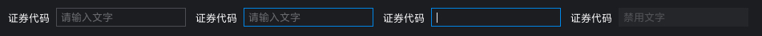

## 扩展形式

> **带前缀和后缀输入框**    [下载控件](终端Confluence.assets/输入框)
>
> 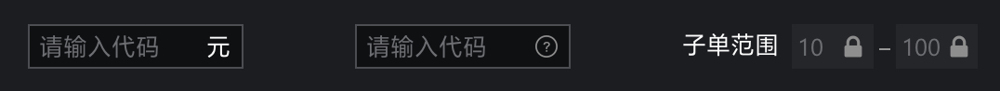

> **搜索框**   [下载控件](终端Confluence.assets/输入框)
>
> - 按钮控件请参阅<u>[Buttom]()</u>控件说明
>
> 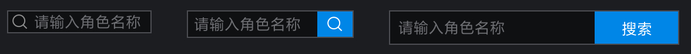

> **输入框组合**
>
> - 组合间距分为两种：`2px`、`0px`
>
> 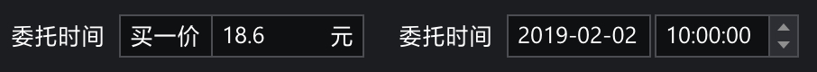

> **带步进控件** [下载控件](终端Confluence.assets/输入框)
>
> 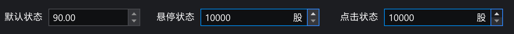

> **文本域**
>
> - 用于多行输入
> - 有下角需要加上控件 [下载控件](终端Confluence.assets/输入框)
>
> 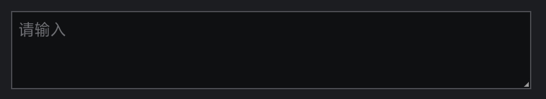

## 控件下载

[下载控件](终端Confluence.assets/输入框)

# Modal 弹窗

## 何时使用

-   需要用户处理事务，又不希望跳转页面以致打断工作流程时，可以使用 `Modal` 在当前页面正中打开一个浮层，承载相应的操作。

## 组件概述

**Header：**弹窗标题栏，用于放置弹窗名称、关闭缩小等控件

**Content1：**弹窗默认底色，可看作一级

**Content2：**弹窗确认内容底色，可看作二级

**Tips_iocn：**主要用于信息提示弹窗的图标

**Trade_icon：**主要用于提示交易买入卖出申购等方向的提示图标

**Button1：**高亮按钮，层级较为突出

**Button2：**一般按钮，用于普通操作的按钮

**Line：**分割线，用于内容的分割

## 基础布局

- 内容区域与容器四周间距为16px
- 标题文字左间距8px，上间距7px
- 关闭控件右间距8px，上间距7px
- 按钮之间间距8px

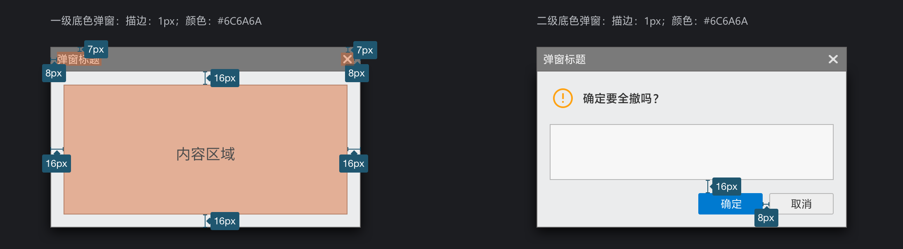

## 尺寸视觉快速查阅

| 名称       | 尺寸 | 视觉（黑） | 视觉（蓝） |
| ---------- | ---- | ---------- | ---------- |
| Header     |      |            |            |
| Content1   |      |            |            |
| Content2   |      |            |            |
| Tips_iocn  |      |            |            |
| Trade_icon |      |            |            |
| Button1    |      |            |            |
| Button2    |      |            |            |
| Line       |      |            |            |

